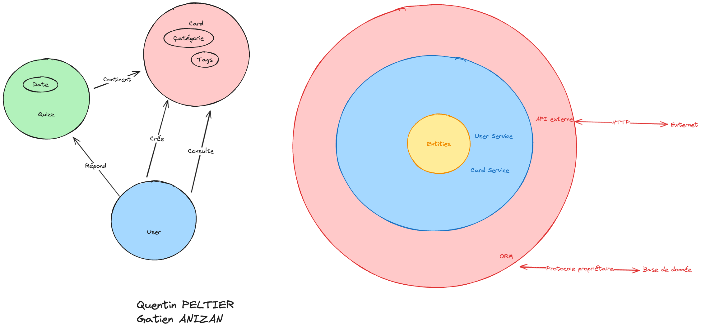

# Cleancode

## Lancement du projet

### Frontend
#### Naviguer dans le dossier frontend

```bash
cd frontend
```

#### Installer les dépendances

```bash
npm install
```

#### Lancer le serveur

```bash
npm run dev
```

#### Lancer les tests

```bash
npm run test:unit
```

### Backend

#### Naviguer dans le dossier backend

```bash
cd backend
```

#### Installer les dépendances

```bash
npm install
```

#### Lancer le serveur

```bash
npm run dev
```

#### Lancer les tests

```bash
npm test
```

## Schémas architecture


